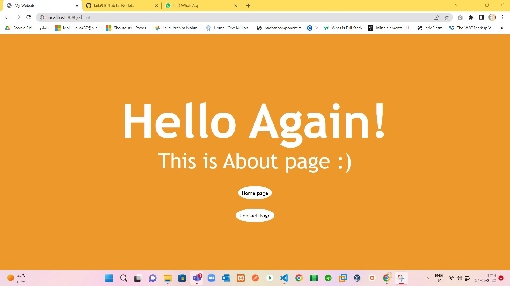

# Part 1
> Create web app using NodeJS
 It should consist of 3 pages at least with navigation links, use NodeJS as server for
 the 3 pages: 

> Solve Part 1 :
 1. Ensure that Node.js is installed. In the terminal run command `node`
 2. run command `mkdir firstServer`
 3. run command `cd firstServer`
 4. create file `start.js` in firstServer folder
 5. loading the http module that’s standard with all Node.js installations `const http = require("http");`
 6.  define two constants, the host and port `const host = 'localhost'; const port = 8000;`
 7. handle an incoming HTTP request and return an HTTP response `const requestListener = function (req, res) {res.writeHead(200);res.end("My first server!");};`
 8. create our server and make use of our request listener: `const server = http.createServer(requestListener);server.liste(port,host, () => {console.log(`Server is running on http://${host}:${port}`);});`
 9. Test by run this command `node start.js`
 10. success running :) as in: 
 11. create 3 html pages (index.html, about.html, contact.html ) in views folder
 12. create htmlFile.js for managing routing with express module 
 13. create fun.js for managing routing using http, fs ,url  modules to manage app and routing of navigation links `about,contact`
 14. index page as in: 
     
 15. After click About button in index page:
     
 16. After Click Contact button in index page:
     

# Part 2
> Create Server App Using NodeJS
 Registration form where user will enter his (name , password, email )
 Validate password should be at least 8 characters if less then show “Error
 password is less than 8 characters” else show “Registration success “

> Solve Part 2:
  1. Ensure that Node.js is installed. In the terminal run command `node`
  2. run command `mkdir secondServer`
  3. run command `cd secondServer`
  4. Create file reg.js
  5. create index.html for registeration form
  6. add registeration form in index.html
  7. using fs, http, url module for managing routing :)

> Solve Part 2:
 1. Registration form with password less than 8 characters , before submit as in :
   
 2. After click submit with less than 8 characters as in:
   
 3. Registration form with valid password , before submit as in:
   
 4. After click submit with valid password as in:
   

# Part 3
> Install express and create a single route (home page) using express framework

> Solve 3 : 
 1. it's simple , its one home page :) as in :
  

